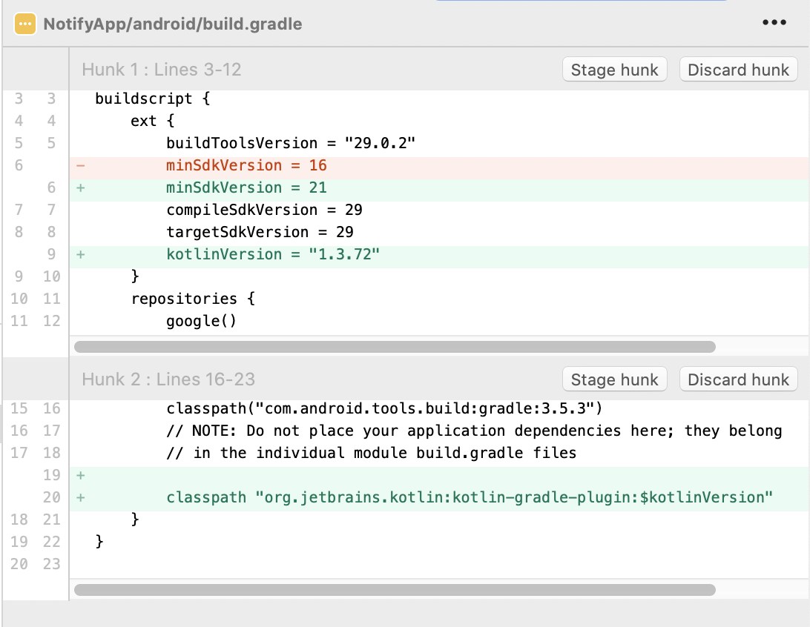

# rn-notifications

*README last updated August 27th, 2020*

An example React Native app to explore best practices for integrating remote notifications for iOS and Android.

In this example I make reference to [Heynow Software](https://www.heynow.com), that's my consultancy shop.

## Common recipe

The common recipe for both platforms is:

```bash
$ npx react-native init NotifyApp
$ cd NotifyApp
$ npx react-native-rename NotifyApp2 -b com.heynow.notifyapp
$ npx react-native-rename NotifyApp -b com.heynow.notifyapp
$ yarn add react-native-notifications
```
At this writing, this will produce a React Native v0.63.2 app.

The two calls to `react-native-rename` are done so as to get a proper bundle identifer (iOS) / package name+applicationID (Android). The default application ID is simply `com.notifyapp`. Gone are the days where you could have done this: `react-native init NotifyApp -package com.heynow.notifyapp`

## iOS setup
Just building this with whatever's currently installed on my personal dev MacBook Pro running Mojave 10.14.6.

```bash
$ node --version
v13.10.1
$ yarn --version
1.22.4
$ pod --version
1.9.1
$ /Applications/Xcode.app/Contents/Developer/usr/bin/xcodebuild -version
Xcode 11.3.1
Build version 11C504
```

### The iOS Recipe
After doing the common recipe listed above, execute this command:

```bash
$ pod install --project-directory=ios/
```

I then opened `ios/NotifyApp.xcworkspace` in Xcode and do the following:

1. Change the bundle id to `com.heynow.NotifyApp` (was `org.reactjs.native.example.NotifyApp`)
2. Assign the team to 'Heynow Software'
3. Add the 'Push Notifications' Capability and the 'Background Modes' Capabality with the 'Remote notifications' checked

### Testing APNs remote notifications

I tried using [pu.sh](https://github.com/tsif/pu.sh/blob/master/pu.sh) to test sending remote notifications using Apple's new [Token-Based Connection to APNs](https://developer.apple.com/documentation/usernotifications/setting_up_a_remote_notification_server/establishing_a_token-based_connection_to_apns), but nothing is arriving.

Using the old tried and true [Certificate-Based Connection to APNs](https://developer.apple.com/documentation/usernotifications/setting_up_a_remote_notification_server/establishing_a_certificate-based_connection_to_apns) works just fine. I used the handy [Pusher](https://github.com/noodlewerk/NWPusher) tool to send notifications to the app. `Pusher` can be brew installed: `brew cask install pusher`

## Android setup
I'm working with Android Studio v3.5.3 running on macOS. This project also builds on Android Studio 4.0.1.

### The Android Recipe
I had to tweak the `app/build.gradle` file to get the app to build on Android Studio v3.5.3 + React Native v0.63.2 
[commit](https://github.com/jkoutavas/rn-notifications/commit/16eaecf8c93069e9005d2b13b38a8b548cb74892):



I then:

1. Did react-native-notifications package integration along with google-services [commit](https://github.com/jkoutavas/rn-notifications/commit/58d832911e568b470badf33a6d19ab0abeab42cc)
2. I created a `google-services.json` file from Heynow's Firebase Console and included it at `NotifyApp/android/app`

### Testing FCM remote notifications

Launching the app from Android Studio or using `npx react-native run-android` brings up the app and the FCM registration token is displayed in the console. I follow the instructions [here](https://firebase.google.com/docs/cloud-messaging/android/first-message) to send a message to this specific device. It works.
